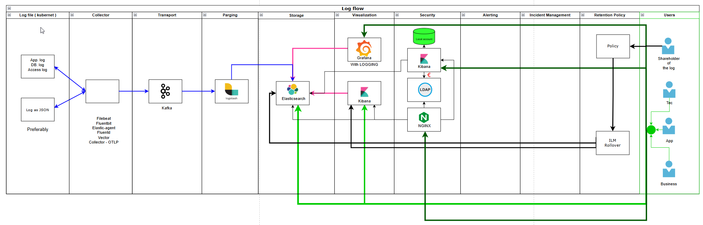

[Back to README](../README.md)

# Diagram: Log flow

Here’s a concise **observability stack overview** summarizing each core component and its role:

---

### **1. Source**

The origin of telemetry data.
Includes all systems, applications, services, and infrastructure that emit **metrics**, **logs**, **traces**, and **events** representing their state and behavior.

---

### **2. Collector**

Responsible for **gathering**, **normalizing**, and **forwarding** telemetry data from various sources.
It may perform **filtering**, **aggregation**, **sampling**, or **enrichment** before sending data onward.

---

### **3. Transport**

The communication layer that moves telemetry data between components.
Typically uses **streaming**, **message queues**, or **network protocols** supporting reliability, compression, and security.

---

### **4. Visualization**

The presentation layer where data is transformed into **dashboards**, **charts**, or **explorable views**.
Enables users to monitor system health, analyze performance trends, and correlate signals.

---

### **5. Parsing**

The process of converting **raw, unstructured, or semi-structured** telemetry into a **consistent, structured format**.
Often includes field extraction, timestamp normalization, and contextual tagging to make data queryable.

---

### **6. Storage**

The persistent layer that retains telemetry data.
Optimized for different data types:

* **Metrics:** high-compression, time-series optimized.
* **Logs:** searchable, schema-flexible.
* **Traces and profiles:** relational or columnar storage with indexing for correlation and retrieval.

---

### **7. Security**

Protects observability data and its pipeline.
Includes:

* **Encryption** (in transit and at rest)
* **Authentication & authorization**
* **Data access governance and auditing**
* **Sanitization of sensitive fields**

---

### **8. Alerting**

Continuously evaluates telemetry against **thresholds**, **rules**, or **anomaly detection models**.
Generates **notifications** when predefined conditions indicate potential issues.

---

### **9. Incident Management**

Processes and systems for **detecting, triaging, and resolving** operational issues.
Involves **escalation workflows**, **communication**, and **post-incident analysis** to improve reliability.

---

### **10. Retention Policy**

Defines **how long data is stored**, **what granularity is preserved**, and **when old data is deleted or archived**.
Balances observability depth, storage cost, and compliance requirements.

