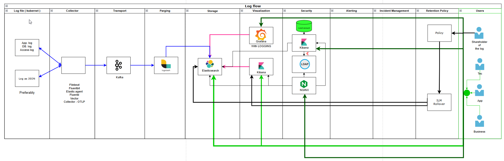

# My-Grafana-tuto
Grafana training 

# Requirements:
OS:
- OS : Windows 11
- PC with 16 Gb RAM
- WSL Ubuntu
- Docker in WSL - install
- Docker compose - install

Vscode:
- extentions:
    - [pomdtr.excalidraw-editor](https://marketplace.visualstudio.com/items?itemName=pomdtr.excalidraw-editor)

    - [ms-azuretools.vscode-containers](https://marketplace.visualstudio.com/items?itemName=ms-azuretools.vscode-docker)
    - [ms-vscode-remote.remote-wsl](https://marketplace.visualstudio.com/items?itemName=ms-vscode-remote.remote-wsl)
    - [ms-azuretools.vscode-docker](https://marketplace.visualstudio.com/items?itemName=ms-azuretools.vscode-docker)
    - [johnpapa.vscode-peacock](https://marketplace.visualstudio.com/items?itemName=johnpapa.vscode-peacock)
    - [rajratnamaitry.open-folder-in-new-vscode](https://marketplace.visualstudio.com/items?itemName=rajratnamaitry.open-folder-in-new-vscode)
    - [HashiCorp.terraform](https://marketplace.visualstudio.com/items?itemName=HashiCorp.terraform)
    - [ms-python.python](https://marketplace.visualstudio.com/items?itemName=ms-python.python)
    - [ms-python.debugpy](https://marketplace.visualstudio.com/items?itemName=ms-python.debugpy)
    - [ms-python.vscode-pylance](https://marketplace.visualstudio.com/items?itemName=ms-python.vscode-pylance)
    - [ms-python.vscode-python-envs](https://marketplace.visualstudio.com/items?itemName=ms-python.vscode-python-envs)

# During 
- 3 to 4 Hours

### 01 🧭 **What is Grafana**

**Grafana** is an **open-source analytics and visualization platform** designed for **monitoring, observability, and operational insights**.
It lets you **query, visualize, alert, and understand** your data from various sources — all in one dashboard.

Originally focused on **time series metrics**, Grafana has evolved into a **full observability suite** that supports **metrics, logs, traces, profiles**, and even **synthetic monitoring**.

---

### ⚙️ **Core Capabilities**

| Capability                  | Description                                                                                                                      |
| --------------------------- | -------------------------------------------------------------------------------------------------------------------------------- |
| **Dashboards**              | Build interactive and customizable visualizations (graphs, tables, gauges, maps, etc.).                                          |
| **Data Source Integration** | Connects to 100+ backends — Prometheus, Loki, Tempo, Elasticsearch, InfluxDB, MySQL, PostgreSQL, Azure Monitor, CloudWatch, etc. |
| **Alerting**                | Define rules based on metrics; send alerts via Slack, email, PagerDuty, or other channels.                                       |
| **Annotations**             | Add contextual events (deployments, incidents) directly on time series graphs.                                                   |
| **Templating & Variables**  | Create dynamic dashboards that adapt based on selected hosts, clusters, or time ranges.                                          |
| **User Management & Auth**  | Supports local users, LDAP, OAuth, SAML, and external identity providers (e.g., Keycloak, Google, GitHub).                       |
| **Plugins**                 | Extend functionality with visualization plugins, data sources, and app integrations.                                             |

---

### 🧩 **Observability Stack Integration**

Grafana is part of the **Grafana Stack**, which includes:

| Component              | Purpose                         |
| ---------------------- | ------------------------------- |
| **Grafana**            | Visualization and dashboards.   |
| **Prometheus / Mimir** | Metrics collection and storage. |
| **Loki**               | Log aggregation.                |
| **Tempo**              | Distributed tracing.            |
| **Pyroscope**          | Continuous profiling.           |
| **Alloy / Agent**      | Unified telemetry collection.   |

These together form a **modern open observability stack**, similar to what Elastic or Datadog offers.

---

### 🖼️ **Visualization Types**

Grafana supports many panel types:
**Time series, Stat, Gauge, Table, Logs, Heatmap, Geomap, Node graph, Bar chart, Pie chart, Canvas, Trace view, Flame graph**, and more.
Each panel can visualize real-time or historical data, supporting thresholds, color rules, and transformations.

---

### 🧑‍💻 **Deployment Options**

Grafana can be deployed in multiple ways:

* 🐳 **Docker / Docker Compose**
* ☸️ **Kubernetes / Helm**
* 💻 **Binary / Package install (Linux, Windows, macOS)**
* ☁️ **Grafana Cloud (managed service)**

---

### 🔒 **Security & Access Control**

* Role-based access (Viewer, Editor, Admin)
* Folder and dashboard permissions
* Data source access controls
* API keys and service accounts for automation

---

### 🚀 **Common Use Cases**

* Infrastructure & application monitoring (with Prometheus)
* Log analysis (with Loki or Elasticsearch)
* Distributed tracing (with Tempo or Jaeger)
* Business KPI dashboards (SQL, CloudWatch, BigQuery)
* Network, IoT, or DevOps observability
* SLO / SLA tracking and alerting

---

Would you like me to summarize this into a **one-page technical overview** (e.g., for documentation or a presentation)?

## [02 - Function diagram of data flux as logs](./lessons/02-Function-diagram-of-data-flux-as-logs.md)

