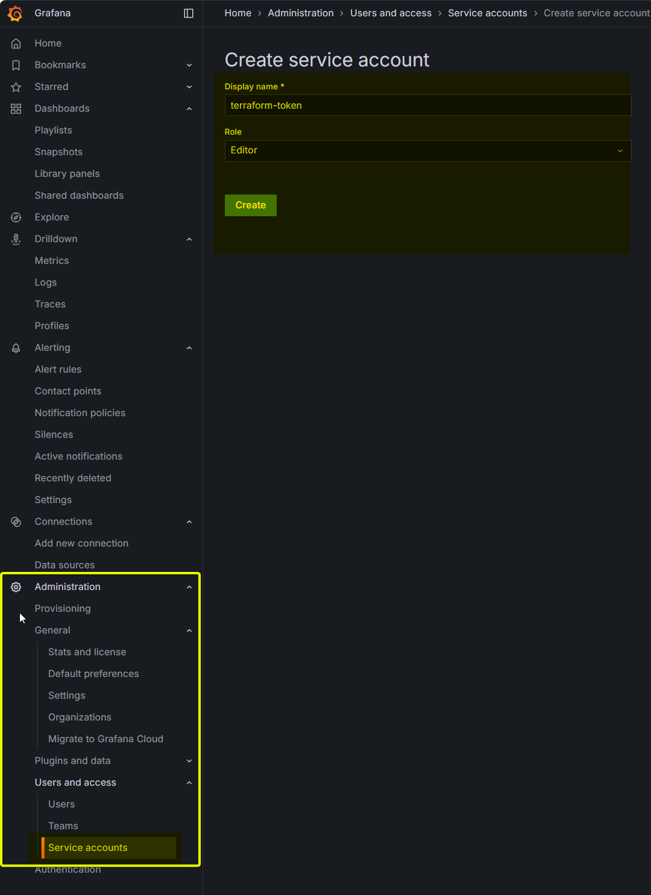
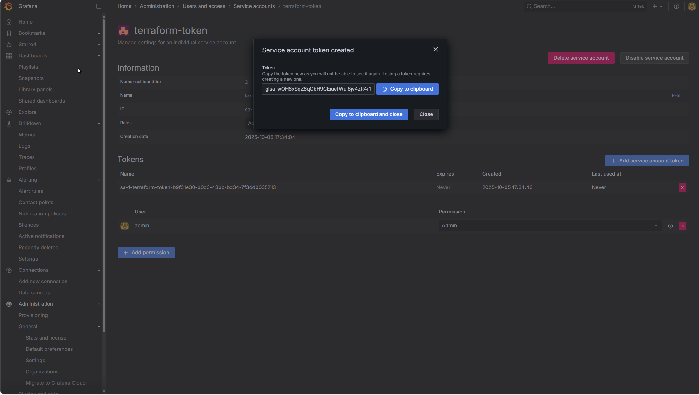

# Add Elasticsearch + Kibana + Elasticsearch export to this project


## Scruture of the topic 

* **`.env` file**
  Stores environment variables. Each topic has its own `.env` file located in the respective directory.

* **`docker-compose-*` files**
  Define the services to be run along with their configurations.

* **`docker/` directory**
  Contains local Docker files referenced by the `docker-compose` configurations.

* **`lessons/` directory**
  Includes installation guides, configuration details, and step-by-step instructions to accomplish the objectives of each lesson.

---

## 🧾 Obejctif of the lesson 

### 🧩 Environment Setup & Verification Checklist

* [ ] copy resource and and delete datasource.

---

Would you like me to format this as a **README section** (with brief explanations under each step)?


### Prometheus container

We add the Prometheus service into the docker compose file: 
- Image: quay.io/prometheus/prometheus:*
- Data location: Docker shared directory
- Configuration file: ./compose/data/prometheus/etc/prometheus.yml

---

### Grafana container

We add the Grafana service into the docker compose file: 
- Image: grafana/grafana:*
- data location: Docker shared directory
- Configuration file: ./compose/data/grafana/etc/provisioning/datasources/datasource.yaml
- 
---

### Elasticsearch container

We add the Grafana service into the docker compose file: 
- Image: ocker.elastic.co/elasticsearch/elasticsearch:*
- data location: ./compose/data/elasticsearch/data
---

### Kibana container

We add the Grafana service into the docker compose file: 
- Image: grafana/grafana:*
- data location: Container’s Writable Layer (Internal)
---

### Elasticsearch exporter container

We add the Grafana service into the docker compose file: 
- Image: grafana/grafana:*
- data location: Docker shared directory
- Configuration file: ./compose/data/elasticsearch_exporter/elasticsearch_exporter.yml
---

### Terraform container

We add the Grafana service into the docker compose file: 
- Image: hashicorp/terraform:1.13.3:*
- dockerfile: ./docker/terraform/Dockerfile.terraform
- data location: Docker shared directory
- Configuration file: ./compose/data/terraform + ./compose/data/.terraform-data
---

### Create-a-Grafana-token

- In Grafana: **Administration → Users and access → Service accounts → New service account → New token**. Give it at least **Admin** on the target org/workspace (or the specific alerting/Datasource perms you need). Save the token string. ([Grafana Labs][1])

#### Grafana: (Manual)

Create the token and save the token in .env file with the variable mamed "GRAFANA_TOKEN".



Get the token



---

### download dashboard id

Dashboard: https://grafana.com/grafana/dashboards/878-elasticsearch-dashboard/ 

Click on "Download JSON" and copy this file to ./compose/data/terraform/dashboard/Group_01/
With the name "Elasticsearch.json"


### Create dashboard groups 

Attach shell **Terraform**

```
cd /workspace
terraform init                 # downloads providers, sets up backend 
terraform validate             # syntax & basic config checks
terraform plan                 # preview changes
terraform apply                # apply (interactive approval)
```

### links
# Promtheus
http://127.0.0.1:9090
# Prometheus - metrics
http://127.0.0.1:9090/metrics
# Grafana 
http://127.0.0.1:3000
# Grafana - metrics
http://127.0.0.1:3000/metrics
# kibana
http://127.0.0.1:8888
# Elastiscearch 
http://127.0.0.1:8881
# Elasticsearch exporter
http://127.0.0.1:9114
# Elasticsearch exporter
http://127.0.0.1:9114/metrics


# start and stop services from docker-compose
Please see, the file named "99-start-and-stop-services.md" in this directory.