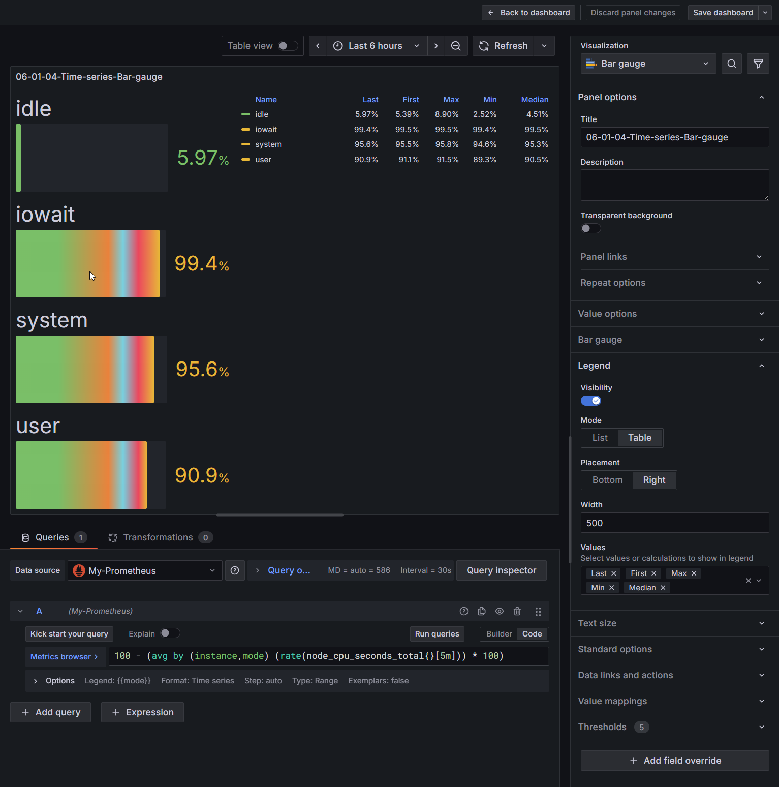

# Create dashboard


## Scruture of the topic 

* **`.env` file**
  Stores environment variables. Each topic has its own `.env` file located in the respective directory.

* **`docker-compose-*` files**
  Define the services to be run along with their configurations.

* **`docker/` directory**
  Contains local Docker files referenced by the `docker-compose` configurations.

* **`lessons/` directory**
  Includes installation guides, configuration details, and step-by-step instructions to accomplish the objectives of each lesson.

---

## 🧾 Obejctif of the lesson 

### 🧩 Setup & Verification Checklist

* [ ] copy resource if needed.
* [ ] Check the docker-compose.05.01.yaml
* [ ] Start the stack using **Docker Compose** from the **VS Code Docker Extension**.
* [ ] Add -> visualization ( top right coner on the dashboard page - combo box - drop down  )
* [ ] On the right top coner - choose the visualization: Bar-gauge
  * [ ] Add the promsql: 
    ```
    100 - (avg by (instance,mode) (rate(node_cpu_seconds_total{}[5m])) * 100)
    ```
  * [ ] Standard options: Unit: Percent (0-100)
  * [ ] Thresholds: YELLOW = 90 ; RED = 80; BLUE = 70 ; ORANGE = 60
  * [ ] Legend: {{mode}}
  * [ ] Legend: Visibity: active + Mode:table + Placemenet: right + with: 500 + Values: last,First,Max,Min,Median

* [ ] Panel options - Title: 05-01-04-Time-series-Bar-gauge

---

### Dashboard view





### Prometheus container

We add the Prometheus service into the docker compose file: 
- Image: quay.io/prometheus/prometheus:*
- Data location: Docker shared directory
- Configuration file: ./compose/data/prometheus/etc/prometheus.yml

---

### Grafana container

We add the Grafana service into the docker compose file: 
- Image: grafana/grafana:*
- data location: Docker shared directory
- Configuration file: ./compose/data/grafana/etc/provisioning/datasources/datasource.yaml
- 
---

### Elasticsearch container

We add the Elasticsearch service into the docker compose file: 
- Image: ocker.elastic.co/elasticsearch/elasticsearch:*
- data location: ./compose/data/elasticsearch/data
---

### Kibana container

We add the Kibana service into the docker compose file: 
- Image: docker.elastic.co/kibana/kibana:*
- data location: Container’s Writable Layer (Internal)
---

### Elasticsearch exporter container

We add the Elasticsearch exporter service into the docker compose file: 
- Image: quay.io/prometheuscommunity/elasticsearch-exporter:*
- data location: Docker shared directory
- Configuration file: ./compose/data/elasticsearch_exporter/elasticsearch_exporter.yml or docker compose file
---

### Terraform container

We add the Terraform service into the docker compose file: 
- Image: hashicorp/terraform:1.13.3:*
- dockerfile: ./docker/terraform/Dockerfile.terraform
- data location: Docker shared directory
- Configuration file: ./compose/data/terraform + ./compose/data/.terraform-data
---

### Fake-metrics

We add the Fake-metrics service into the docker compose file: 
- dockerfile: ./docker/fake-metrics/Dockerfile
---


### links
### Promtheus
http://127.0.0.1:9090
### Prometheus - metrics
http://127.0.0.1:9090/metrics
### Grafana 
http://127.0.0.1:3000
### Grafana - metrics
http://127.0.0.1:3000/metrics
### kibana
http://127.0.0.1:8888
### Elastiscearch 
http://127.0.0.1:8881
### Elasticsearch exporter
http://127.0.0.1:9114
### Elasticsearch exporter
http://127.0.0.1:9114/metrics
### fake-metrics
http://127.0.0.1:9500/metrics

# start and stop services from docker-compose
Please see, the file named "99-start-and-stop-services.md" in this directory.