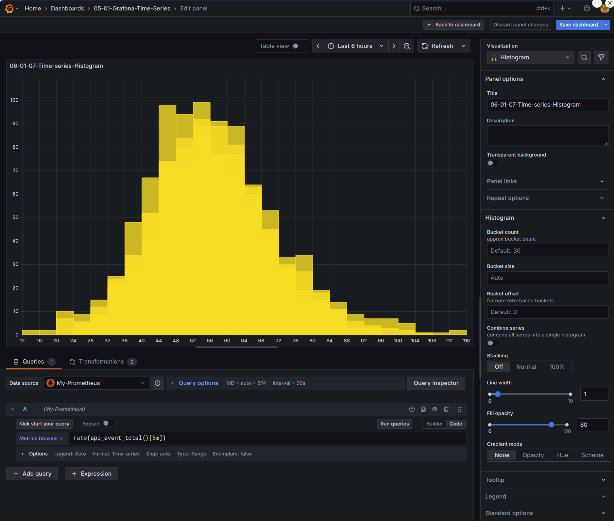

# Create dashboard


## Scruture of the topic 

* **`.env` file**
  Stores environment variables. Each topic has its own `.env` file located in the respective directory.

* **`docker-compose-*` files**
  Define the services to be run along with their configurations.

* **`docker/` directory**
  Contains local Docker files referenced by the `docker-compose` configurations.

* **`lessons/` directory**
  Includes installation guides, configuration details, and step-by-step instructions to accomplish the objectives of each lesson.

---

## 🧾 Obejctif of the lesson 

### 🧩 Setup & Verification Checklist

* [ ] Copy resource if needed.
* [ ] Check the docker-compose.05.01.yaml
* [ ] Start the stack using **Docker Compose** from the **VS Code Docker Extension**.
* [ ] Add -> visualization ( top right coner on the dashboard page - combo box - drop down  )
* [ ] No the new panel select: on the buger icon ( right top corner) - Inspect - Panle JSON
  * [ ] Paste the following JSON content:
    ```JSON
    {
    "id": 8,
    "type": "heatmap",
    "title": "05-01-08-Time-series-Heatmap",
    "gridPos": {
        "x": 0,
        "y": 32,
        "h": 8,
        "w": 12
    },
    "fieldConfig": {
        "defaults": {
        "custom": {
            "scaleDistribution": {
            "type": "linear"
            },
            "hideFrom": {
            "tooltip": false,
            "viz": false,
            "legend": false
            }
        }
        },
        "overrides": []
    },
    "pluginVersion": "12.2.0",
    "targets": [
        {
        "editorMode": "code",
        "expr": "app_event_total{}",
        "legendFormat": "{{name}}",
        "range": true,
        "refId": "A"
        }
    ],
    "datasource": {
        "type": "prometheus",
        "uid": "prometheus"
    },
    "options": {
        "calculate": false,
        "yAxis": {
        "axisPlacement": "left",
        "reverse": false
        },
        "rowsFrame": {
        "layout": "auto"
        },
        "color": {
        "mode": "scheme",
        "fill": "dark-orange",
        "scale": "exponential",
        "exponent": 0.5,
        "scheme": "Rainbow",
        "steps": 64,
        "reverse": false
        },
        "cellGap": 7,
        "filterValues": {
        "le": 1e-9
        },
        "tooltip": {
        "mode": "single",
        "yHistogram": false,
        "showColorScale": false
        },
        "legend": {
        "show": true
        },
        "exemplars": {
        "color": "rgba(255,0,255,0.7)"
        }
    }
    }
    ```
* [ ] Panel options - Title: 05-01-07-Time-series-Histogram
* [ ] Save dashboard - Right top corner - my-dasboard


---

### Dashboard view





### Prometheus container

We add the Prometheus service into the docker compose file: 
- Image: quay.io/prometheus/prometheus:*
- Data location: Docker shared directory
- Configuration file: ./compose/data/prometheus/etc/prometheus.yml

---

### Grafana container

We add the Grafana service into the docker compose file: 
- Image: grafana/grafana:*
- data location: Docker shared directory
- Configuration file: ./compose/data/grafana/etc/provisioning/datasources/datasource.yaml
- 
---

### Elasticsearch container

We add the Elasticsearch service into the docker compose file: 
- Image: ocker.elastic.co/elasticsearch/elasticsearch:*
- data location: ./compose/data/elasticsearch/data
---

### Kibana container

We add the Kibana service into the docker compose file: 
- Image: docker.elastic.co/kibana/kibana:*
- data location: Container’s Writable Layer (Internal)
---

### Elasticsearch exporter container

We add the Elasticsearch exporter service into the docker compose file: 
- Image: quay.io/prometheuscommunity/elasticsearch-exporter:*
- data location: Docker shared directory
- Configuration file: ./compose/data/elasticsearch_exporter/elasticsearch_exporter.yml or docker compose file
---

### Terraform container

We add the Terraform service into the docker compose file: 
- Image: hashicorp/terraform:1.13.3:*
- dockerfile: ./docker/terraform/Dockerfile.terraform
- data location: Docker shared directory
- Configuration file: ./compose/data/terraform + ./compose/data/.terraform-data
---

### Fake-metrics

We add the Fake-metrics service into the docker compose file: 
- dockerfile: ./docker/fake-metrics/Dockerfile
---


### links
### Promtheus
http://127.0.0.1:9090
### Prometheus - metrics
http://127.0.0.1:9090/metrics
### Grafana 
http://127.0.0.1:3000
### Grafana - metrics
http://127.0.0.1:3000/metrics
### kibana
http://127.0.0.1:8888
### Elastiscearch 
http://127.0.0.1:8881
### Elasticsearch exporter
http://127.0.0.1:9114
### Elasticsearch exporter
http://127.0.0.1:9114/metrics
### fake-metrics
http://127.0.0.1:9500/metrics

# start and stop services from docker-compose
Please see, the file named "99-start-and-stop-services.md" in this directory.