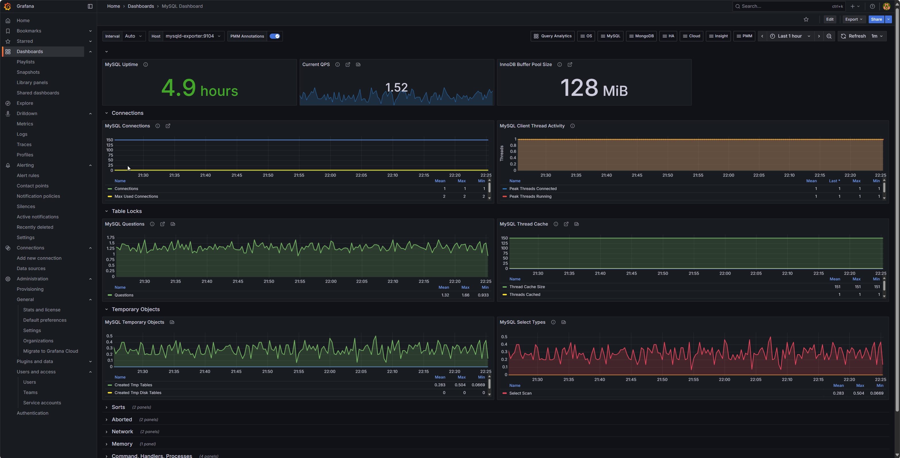

## From the Grafana UI

1-Log in to Grafana.

2-Go to the left menu → Dashboards → + Import.

3-In the “Import via grafana.com” field, enter the Dashboard ID (e.g., 1860 for Node Exporter Full).

4-Click Load.

5-Select the data source(s) the dashboard should use.

6-Click Import.

Dashboard to import: https://grafana.com/grafana/dashboards/23463-mysql-test/

